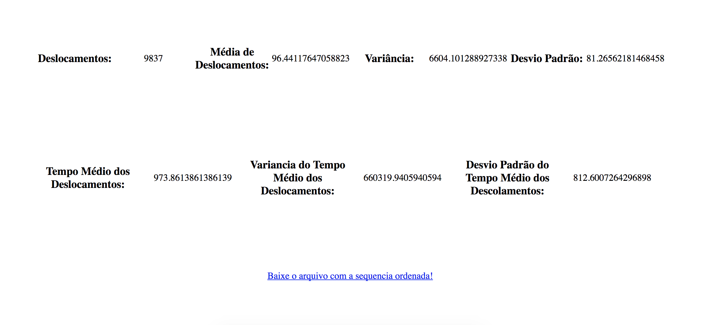

# gerenciamento-de-memoria

Aplicação que implementa algoritmos de acesso à disco.

Os algoritmos implementados são:
* FIFO
* SSF
* SCAN
* C-SCAN

Especificações: [PROJETO](media/projeto.pdf).

## Prévia

## Desenvolvedores
* Augusto Falcão | @falcaoaugustos
* Caio Cavalcante | @caio629
* Rafael Coelho | @rafaellcoellho

## Uso

Para executar esse projeto, clone o repositório e execute o projeto.
Preencha o formulário com as informações do disco.
Carregue o arquivo que contenha o conjunto de acessos.
Clique no algoritmo de sua preferência para obter as informações de saída.

## Contribuição

Contribuições são bem vindas. Sinta-se a vontade para mandar um pull request, caso queira contribuir.

## Licença

Este projeto possui licença MIT. Leia "LICENSE" para maiores informações.
