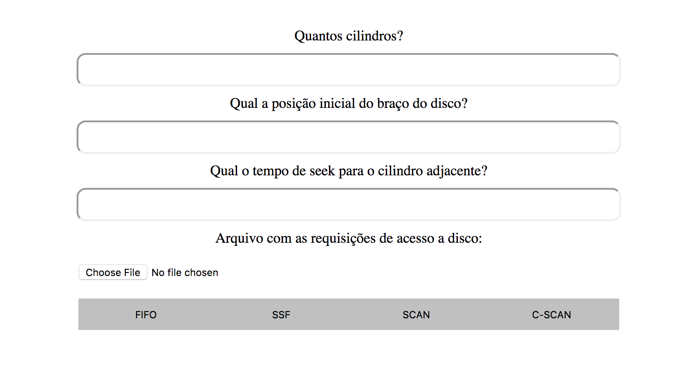

# gerenciamento-de-memoria

Aplicação que implementa algoritmos de acesso à disco.

## Prévia

## Desenvolvedores
* Augusto Falcão | @falcaoaugustos
* Caio Cavalcante | @caio629
* Rafael Coelho | @rafaellcoellho

## Uso

Para executar esse projeto, clone o repositório e execute o projeto.

## Contribuição

Contribuições são bem vindas. Sinta-se a vontade para mandar um pull request, caso queira contribuir.

## Licença

Este projeto possui licença MIT. Leia "LICENSE" para maiores informações.